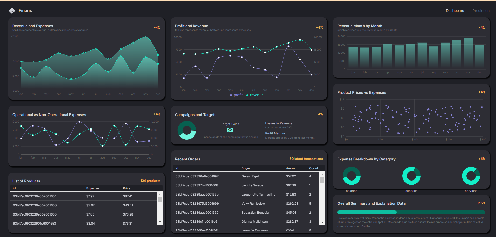

# Finans-Dashboard

# Finansal Dashboard Projesi

Bu proje, finansal verileri yönetmek ve görselleştirmek için geliştirilen bir dashboard uygulamasıdır. Uygulama, kullanıcıların finansal performansı izlemesine ve analiz etmesine olanak tanır.

## Özellikler

### 1. KPI Yönetimi
- **Günlük ve aylık KPI verilerini yönetme**
- **Toplam kâr, toplam gelir ve toplam gider bilgileri**
- **Kategori bazında gider yönetimi**

### 2. Ürün Yönetimi
- **Ürün fiyatları ve giderleri**
- **Ürünlerin işlem geçmişi**

### 3. İşlem Yönetimi
- **İşlem geçmişi yönetimi**
- **Alıcı bilgileri ve işlem tutarları**
- **İlgili ürünlerin listesi**

## Teknik Gereksinimler

1. **Node.js ve Express.js kullanarak RESTful API geliştirme**
2. **MongoDB veritabanı kullanımı ve Mongoose ORM entegrasyonu**
3. **API dokümantasyonu (Swagger/OpenAPI)**
4. **Güvenlik önlemleri (input validasyonu, sanitizasyon)**
5. **Finansal verilerin işlenmesi ve analiz edilmesi**

### Dashboard Ekran Görüntüsü


## Proje Yapısı

### Backend

#### Modeller

- **KPI Modeli**
- **Ürün Modeli**
- **İşlem Modeli**

#### Rotalar

- **KPI Rotaları**
- **Ürün Rotaları**
- **İşlem Rotaları**

### Frontend

- **Komponentler**
  - **BoxHeader**
  - **DashboardBox**
  - **FlexBetween**

- **Dashboard**
- **Predictions**

### Durum Yönetimi ve Veri Çekme

- **Redux Toolkit Query**
- **API Entegrasyonu**

## Kullanım

1. **Projeyi klonlayın**:
    ```sh
    git clone https://github.com/talha3755/Finans-Dashboard.git
    ```

2. **Backend'i çalıştırın**:
    ```sh
    cd backend
    npm install
    npm run dev
    ```

3. **Frontend'i çalıştırın**:
    ```sh
    cd frontend
    npm install
    npm run dev
    ```

4. **Tarayıcıda açın**:
    ```sh
    http://localhost:3000
    ```

## Katkıda Bulunanlar

- **Talha Şekerci**

## Lisans

Bu proje MIT Lisansı kapsamında lisanslanmıştır.

